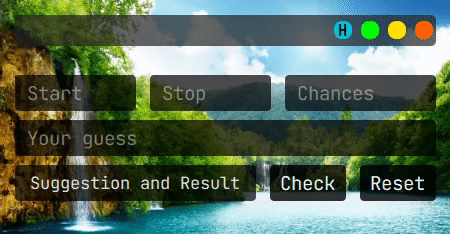

# Number_Guessing
To start guessing choose your number range, specify your chance value and start guessing, I hope you like it

## Requires

```bash
  pip install PyQt5
```
## Usage/Examples
<kbd>
 
</kbd>

## Author
- Github: [@Aminjjjeffrey](https://github.com/Aminjjjeffrey)
- Twitter: [@Aminjjjeffrey](https://twitter.com/Aminjjjeffrey)


